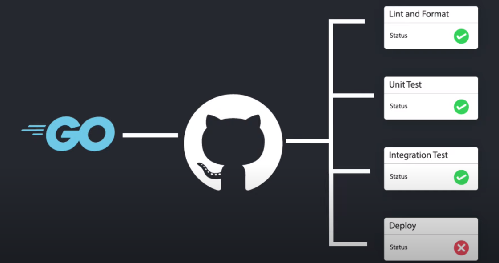

## Golang GIthub Actions
Sample project implemeting gitlab actions in GO  

### References
Quick references for this project to help you get started or debug

[getting started with gitlab actions](https://docs.github.com/en/actions/quickstart)
