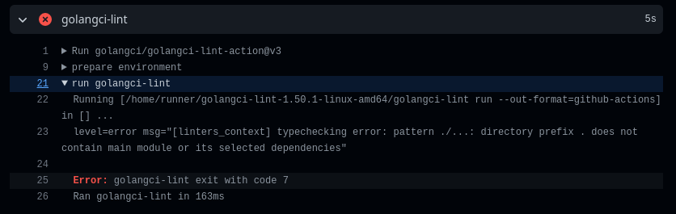

## Golang Github Actions
Sample project implemeting gitlab actions in GO <br>


### References
Quick references for this project to help you get started or debug

[getting started with gitlab actions](https://docs.github.com/en/actions/quickstart) <br>
[golangci](https://golangci-lint.run/#demo) simple ci linter for golang

## gotchas
you must initialize go module ```go mod init main.go``` for the linter to work or you will get the error: <br>

